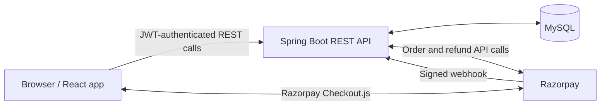

# SecurePay — Payment & Order Management System

SecurePay is a full-stack payment and order management application built with a React frontend and a Java Spring Boot REST API. It supports customer shopping and checkout, role-restricted administration, and Razorpay payment processing.

## Features

- Customer registration and login with JWT authentication.
- `USER` and `ADMIN` roles, with role-based API authorization.
- Product catalog and admin product create, update, and soft deactivation.
- Customer-owned cart operations and order history.
- Order creation with delivery/contact snapshots and item/price snapshots.
- Admin order list, details, and validated status transitions.
- Razorpay order creation, server-side payment verification, and signed webhooks.
- Idempotent payment handling for repeated verification and webhook events.
- Admin-initiated Razorpay refunds.
- Customer order history displays order and payment statuses independently.
- Transactional, concurrency-safe inventory reservation and idempotent release.
- Request validation and centralized, sanitized API error responses.
- Dockerfiles and Docker Compose for a local containerized stack.
- A production Spring profile, an Nginx-served frontend, and automated backend/frontend tests.

## Technology stack

| Area | Technologies |
| --- | --- |
| Frontend | React 19, JavaScript, Vite 8, React Router 7 |
| Backend | Java 21, Spring Boot 4.0.8, Spring MVC, Spring Data JPA, Hibernate, Bean Validation, Maven |
| Database | MySQL; Docker Compose uses MySQL 8.4 |
| Security | Spring Security, JWT (JJWT), BCrypt password hashing, `USER`/`ADMIN` authorization |
| Payments | Razorpay Java SDK and Razorpay Checkout.js |
| Testing | JUnit 5, Mockito, Spring Boot Test, Vitest, React Testing Library, user-event, jest-dom, jsdom |
| DevOps/deployment | Docker, Docker Compose, Nginx, Render, AWS RDS MySQL |

## Architecture



In the local container setup, Compose runs the frontend, backend, and MySQL as separate services. In a browser, the frontend calls the backend through the configured API base URL; Razorpay Checkout runs in the browser while payment verification and webhook processing are handled by the backend.

## Authentication and authorization

Registration and login are handled by `POST /api/auth/register` and `POST /api/auth/login`. Passwords are stored using BCrypt. A successful login returns a JWT, which the frontend sends as a bearer token on authenticated requests.

Customer order and payment operations are scoped to the authenticated user. Product administration, admin order operations, and refunds require the `ADMIN` role. The frontend also protects the admin route for navigation, while backend security remains the authorization boundary. CORS allowed origins are configurable; development defaults support the local Vite origins.

## Order and payment lifecycle

The implemented order statuses are:

`CREATED` → `PAYMENT_PENDING` → `PAID` → `PROCESSING` → `SHIPPED` → `DELIVERED`

Orders may also transition to `CANCELLED` where the lifecycle permits. Admin transitions are validated by the backend. The generic admin status endpoint cannot move a `PAYMENT_PENDING` order to `PAID`; successful payment verification or a valid Razorpay webhook is authoritative for that transition.

The implemented payment statuses are:

`CREATED`, `PENDING`, `SUCCESS`, `FAILED`, and `REFUNDED`.

Payment failure is represented separately from order cancellation. A failed payment can be retried while the order remains in an eligible state. A successful admin refund marks the payment `REFUNDED` and cancels the order according to the existing refund lifecycle.

## Inventory concurrency

Order creation runs transactionally. Inventory reservation aggregates quantities by product ID, locks product rows with pessimistic write locks in deterministic product-ID order, checks availability, and then decreases stock. This prevents concurrent requests from both reserving the same available units through the ordinary order flow.

An inventory-reservation flag on each order records whether the reservation remains active. Cancellation and eligible refund flows release reserved stock once; release also locks the affected products in deterministic order. Legacy orders with a null reservation flag are treated as reserved. This is database row locking, not distributed locking. There is no scheduled unpaid-order expiry; failed payments can remain retryable while their order is pending.

## Razorpay integration

- The backend creates or reuses Razorpay orders using the stored SecurePay payment amount.
- The client returns Razorpay payment identifiers and signature to the backend for server-side verification.
- Verification checks the stored Razorpay order ID and validates an HMAC-SHA256 signature.
- `POST /api/payments/webhook/razorpay` validates the `X-Razorpay-Signature` against the raw webhook body. The implemented events include `payment.captured`, `payment.failed`, and `order.paid`.
- Payment/order records are locked during relevant processing, and repeated success/failure events are handled idempotently. A later failure event does not downgrade a successful or refunded payment.
- Refunds are initiated by an admin using the stored Razorpay payment ID and amount. Local state is updated only after Razorpay accepts the refund request.

Razorpay credentials and webhook secrets are supplied through environment variables. They must not be placed in source control or frontend code.

## API overview

All routes below use the `/api` prefix. Except for registration, login, and the signed webhook endpoint, API access requires authentication. Admin-only routes are marked.

| Area | Routes | Purpose/access |
| --- | --- | --- |
| Authentication | `POST /auth/register`, `POST /auth/login` | Create an account and obtain a JWT; public |
| Products | `GET /products`, `GET /products/{id}` | Read the catalog; authenticated |
| Products | `POST /products`, `PUT /products/{id}`, `DELETE /products/{id}` | Create, update, and soft-deactivate products; admin |
| Cart | `GET /cart`, `POST /cart/items`, `PUT /cart/items/{cartItemId}`, `DELETE /cart/items/{cartItemId}`, `DELETE /cart` | Current customer’s cart |
| Customer orders | `POST /orders`, `GET /orders`, `GET /orders/{orderId}` | Create and view the current customer’s orders |
| Admin orders | `GET /admin/orders`, `GET /admin/orders/{orderId}`, `PUT /admin/orders/{orderId}/status` | Admin order management |
| Customer payments | `POST /payments/orders/{orderId}`, `POST /payments/orders/{orderId}/razorpay`, `POST /payments/orders/{orderId}/verify` | Create/reuse payment and Razorpay order, then verify payment |
| Customer payments | `GET /payments`, `GET /payments/orders/{orderId}` | Read the current customer’s payment records |
| Admin payments | `GET /payments/admin/orders/{orderId}`, `POST /payments/orders/{orderId}/refund` | Read payment details and initiate a refund; admin |
| Razorpay webhook | `POST /payments/webhook/razorpay` | Receive signed Razorpay events; signature validated by the application |

## Project structure

```text
.
├── src/
│   ├── main/java/com/securepay/
│   │   ├── config/          # Spring Security and Razorpay configuration
│   │   ├── controller/      # REST API controllers
│   │   ├── dto/             # Validated request and response DTOs
│   │   ├── entity/          # JPA entities and status enums
│   │   ├── exception/       # Domain exceptions and API error handling
│   │   ├── repository/      # Spring Data repositories
│   │   ├── security/        # JWT service and authentication filter
│   │   └── service/         # Application, payment, and inventory logic
│   ├── main/resources/      # Default and production Spring configuration
│   └── test/java/           # Backend tests
├── frontend/
│   ├── src/components/      # Shared UI components
│   ├── src/pages/           # Customer/admin pages and page tests
│   ├── src/services/        # Authentication, API configuration, and service tests
│   └── src/test/            # Shared Vitest setup
│   ├── Dockerfile
│   └── nginx.conf
├── docker/mysql/init/       # Schema initialization for a new Compose database
├── Dockerfile               # Multi-stage Spring Boot image
├── docker-compose.yml
├── pom.xml
└── README.md
```

## Local development setup

### Prerequisites

- Java 21
- The included Maven wrapper
- Node.js and npm
- MySQL, or Docker with Docker Compose
- Razorpay test credentials when exercising payment operations

### Backend

The default Spring configuration expects a MySQL database named `securepay` on `localhost:3306`, with username `root`. Provide the password and application secrets in the shell environment; do not commit them.

PowerShell example (replace placeholders locally):

```powershell
$env:DB_PASSWORD = '<local-mysql-password>'
$env:JWT_SECRET = '<long-random-jwt-secret>'
$env:RAZORPAY_KEY_ID = '<razorpay-test-key-id>'
$env:RAZORPAY_KEY_SECRET = '<razorpay-test-key-secret>'
$env:RAZORPAY_WEBHOOK_SECRET = '<razorpay-test-webhook-secret>'
.\mvnw.cmd spring-boot:run
```

The default development profile uses Hibernate `ddl-auto=update` and SQL logging. The production profile uses `ddl-auto=validate` and does not emit SQL statement logging.

### Frontend

From the `frontend` directory:

```sh
npm install
npm run dev
```

The API base URL defaults to `http://localhost:8080`. To override it for a Vite build or dev server, set `VITE_API_BASE_URL` in the frontend environment.

## Docker

The backend `Dockerfile` builds the existing Maven application in a Java 21 builder stage and runs it in a Java 21 JRE image. The frontend `Dockerfile` builds the Vite app with Node.js and serves its static files from Nginx. Nginx falls back to `index.html` so React Router routes work on direct navigation and refresh.

Docker Compose defines MySQL, backend, and frontend services. MySQL data is stored in the named `securepay-mysql-data` volume, and the backend waits for the MySQL health check. The MySQL initialization script creates the current schema only when MySQL initializes a new data directory; it does not act as a migration system for an existing volume. The backend container activates the `prod` Spring profile.

To run locally:

1. Copy `.env.example` to `.env` and replace its placeholders with local values. The root `.env` is ignored by Git.
2. Run `docker compose up --build` from the repository root.
3. Open the frontend at `http://localhost:3000`; the API is published at `http://localhost:8080`.

## Production and deployment

The production Spring profile reads database location/credentials, JWT and Razorpay secrets, CORS origins, and server port from environment variables. It validates the existing schema rather than changing it at startup.

The current deployed arrangement is Render for the frontend and backend, with MySQL hosted by AWS RDS. Provider settings are managed outside this repository; there are no Render or AWS infrastructure manifests here. The deployed payment flow has been manually verified using Razorpay test credentials, as reported for this project.

## Testing and verification

The following are the latest recorded project results, not guarantees about every environment:

- **Backend:** 95 tests passed, with no failures or errors in the latest available Surefire reports.
- **Frontend:** 8 Vitest tests passed across 5 test files.
- **Frontend lint:** `npm run lint` passed.
- **Frontend production build:** `npm run build` passed.
- **Manual flows:** Docker Compose payment flow and the Render + AWS RDS + Razorpay test payment flow have been reported as verified. These are manual checks, not automated tests.

Run the checks with:

```sh
mvn test
cd frontend
npm run test
npm run lint
npm run build
```

## Security notes

- Database, JWT, and Razorpay secrets are read from environment variables; keep local `.env` files out of Git.
- JWT bearer authentication protects customer and administrative APIs. Admin operations require the `ADMIN` role.
- Order and payment reads/actions apply customer ownership checks where applicable.
- Payment verification and webhook signatures are checked server-side using HMAC-SHA256.
- Request DTOs use Bean Validation; expected domain errors are returned through centralized exception handling.
- CORS origins are configurable. Restrict production configuration to the actual frontend origin.

These controls reduce specific risks but do not constitute an absolute security guarantee. Production deployments still require correctly managed secrets, database access controls, and operational monitoring.

## Future improvements

- Add schema migration/versioning tooling such as Flyway or Liquibase for ongoing deployments.
- Add password reset and customer profile management.
- Expand frontend coverage to additional page and error states.
- Consider unpaid-order expiry if the product requires reservations to end automatically; no scheduled expiry is currently implemented.

## License

No license is currently specified in this repository.
